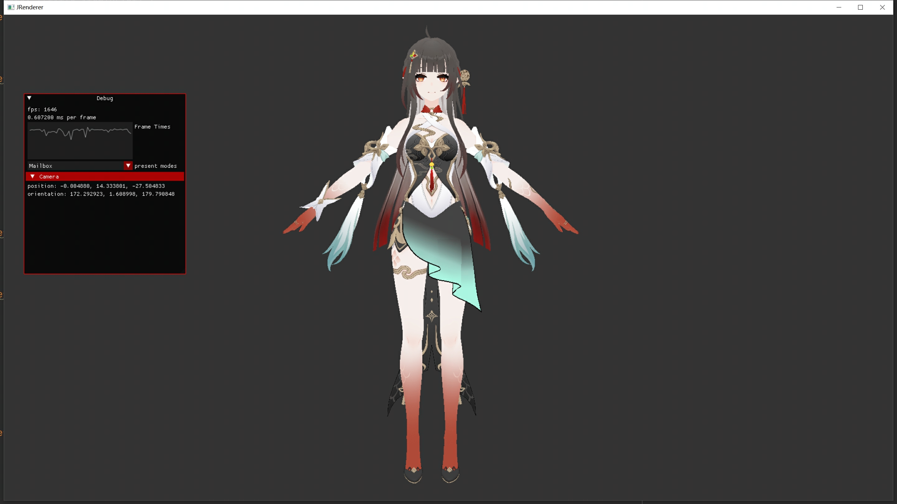

# JRenderer

A c++ vulkan renderer to learn

## Build, Install And Run
use [CMake](https://cmake.org/)

1. git clone https://github.com/gh835470669/JRenderer.git --recurse-submodules
或者 
git clone https://github.com/gh835470669/JRenderer.git 
克隆下来后执行git submodule update --init --recursive
保证子模块也clone
克隆仓库完毕，接下来config项目
2. cd JRenderer
工作目录跳转到项目根目录
3. mkdir build
4. cmake -S. -B./build
等待解决方案生成完毕，接着build项目
5. cmake --build ./build --config Release
生成Relase版可执行文件
然后安装（构造可运行环境：dll和资源目录）
6. mkdir install  （也可以自己选任意一个目录，在下面的--prefix后面把此目录的路径传进去就行）
7. cmake --install ./build --prefix ./install
安装完毕，工作目录转到安装目录，运行 JRenderApp.exe
8. cd install
9. JRenderApp.exe

## Features
* [Vulkan](https://www.vulkan.org/) cross-platform graphics api
  * 使用<vulkan/vulkan_shared.hpp> easy to shared raii vulkan resource
  * **builder pattern** to buld vulkan resource
  * Multi CPU Frame
  * [Specialization Constants](https://docs.vulkan.org/samples/latest/samples/performance/specialization_constants/README.html)
  * [scalar alignment](https://docs.vulkan.org/guide/latest/shader_memory_layout.html)
  * [Runtime mip-map generation](https://docs.vulkan.org/samples/latest/samples/api/texture_mipmap_generation/README.html)
* C++
	* [glm](https://github.com/g-truc/glm) C++ mathematics library
	* [fmt](https://github.com/fmtlib/fmt) formatting library
	* [GSL](https://github.com/microsoft/GSL) The C++ Core Guidelines Support Library (GSL) 
	* [gainput](https://github.com/jkuhlmann/gainput) input system
	* [Camera](https://github.com/Crydsch/camera) 3D camera library
	* [Dear ImGui](https://github.com/ocornut/imgui) Dear ImGui is one possible implementation of an idea generally described as the IMGUI (Immediate Mode GUI) paradigm
	* [MMDFormats](https://github.com/oguna/MMDFormats) load model file (.pmx)
	* [stb](https://github.com/nothings/stb) load image file (.png .jpg)
	* [std::ranges](https://en.cppreference.com/w/cpp/ranges) views + operator pipe to iterate
* [CMake](https://cmake.org/) C++ Meta Build System
* Profile & Debug
	* [tracy](https://github.com/wolfpld/tracy) A real time, nanosecond resolution, remote telemetry, hybrid frame and sampling profiler
	* [RenderDoc](https://renderdoc.org/) graphics debugger
* Shading
  * Non-photorealistic rendering (NPR)
  * ramp texture
  * Vertex Extrusion Outline ([5 ways to draw an outline](https://ameye.dev/notes/rendering-outlines/))
